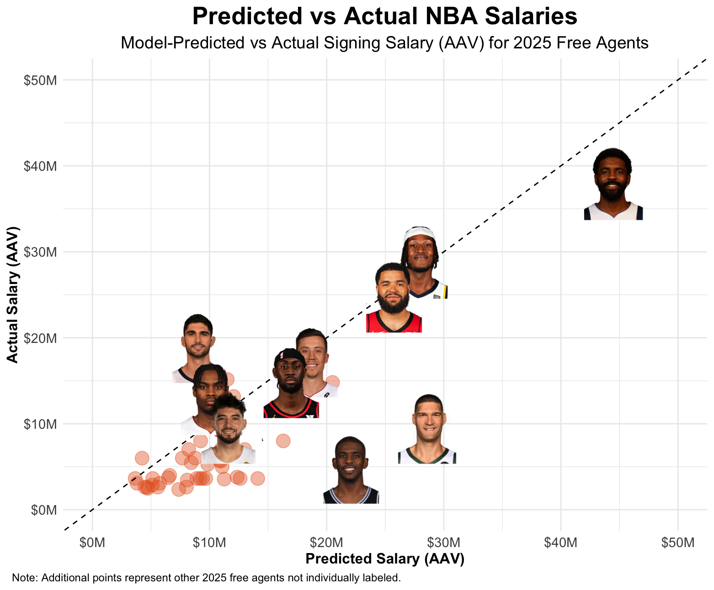

# NBA Free Agency Salary Projections

## Goal
Predict salaries for players entering free agency, expressed as a percentage of the NBA salary cap, to support valuation, negotiation, and roster planning decisions.

## Data Sources
- **Salaries**: ESPN (past 10 seasons), Spotrac (historical cap values, 2025 free agent contracts).
- **Performance** **Stats**: NBA.com (per-36 & advanced metrics).
- **Metadata**: hoopR R package (player & team data).
- **Cap Figures**: Manually compiled from Spotrac.

## Data Preparation
- Merged multiple sources, reconciled naming inconsistencies, filled missing data.
- **Target variable: Salary % of cap** for cross-year comparability.
- Initial feature set: 50+ variables → reduced to ~20 via EDA, correlation checks, and redundancy removal.
- Final features selected with statistical tests, LASSO regression, and VIF analysis.

## Modelling Approach
- Train/Test Split – 80/20 historical player-seasons.
- Baselines – Simple linear regression with top predictors.
- Expanded Models – Full features, significant-only, LASSO.
- Tree-Based Models – Random Forest, XGBoost (grid search + 5-fold CV for hyperparameters).
- Validation – Calibration plots across low/mid/high salaries; monitored test vs. train performance.

## Key Metrics
- R² – Variance explained.
- MAE – Average prediction error.
- RMSE – Penalizes large misses.

## Best Model
**Random Forest** 
  - R² = 0.74
  - MAE = 0.034
  - RMSE = 0.047 (cap %)
  - ~$4M average error using 2025–26 cap.
- **Top Features**: % Games Started, Minutes Per Game, Years of Experience.

## Assumptions
- Salaries normalized by cap % for comparability.
- Relationship between performance & salary is consistent across roles and positions.
- Most contracts reflect market value from observable performance (intangibles excluded).
- Salaries are forward-looking estimates of expected value.
- Over/under predictions treated equally.
- Rookie-scale players (first 3 seasons) excluded; low-usage players included.

## Challenges
- Data integration from multiple sources; naming/coding inconsistencies.
- Missing contract details (options, incentives, exceptions) limits model realism.
- Trade-off between transparency (linear models) and accuracy (tree-based).
- Non-quantifiable factors (leadership, fit, off-court) excluded.

## Next Steps
- Add contract structure details (options, length, exceptions, guarantees).
- Integrate qualitative/contextual variables (injuries, leadership, role changes).
- Expand evaluation to all 2025 and prior free agent classes.
- Incorporate player projections to reflect forward-looking team decision-making.
- Refine model for better calibration near the tails.

## Results & Visualization

